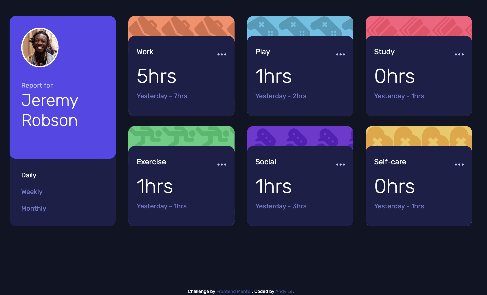

# Frontend Mentor - Time tracking dashboard solution

This is a solution to the [Time tracking dashboard challenge on Frontend Mentor](https://www.frontendmentor.io/challenges/time-tracking-dashboard-UIQ7167Jw). Frontend Mentor challenges help you improve your coding skills by building realistic projects. 

## Table of contents

- [Overview](#overview)
  - [The challenge](#the-challenge)
  - [Screenshot](#screenshot)
  - [Links](#links)
- [My process](#my-process)
  - [Built with](#built-with)
  - [What I learned](#what-i-learned)
- [Author](#author)

## Overview

### The challenge

Users should be able to:

- View the optimal layout for the site depending on their device's screen size
- See hover states for all interactive elements on the page
- Switch between viewing Daily, Weekly, and Monthly stats

### Screenshot

### Links

- Solution URL: [https://www.frontendmentor.io/solutions/time-tracking-dashboard-yPUj9ND7T](https://www.frontendmentor.io/solutions/time-tracking-dashboard-yPUj9ND7T)
- Live Site URL: [https://anle9650.github.io/time-tracking-dashboard/](https://anle9650.github.io/time-tracking-dashboard/)

## My process

### Built with

- Semantic HTML5 markup
- CSS custom properties
- Flexbox
- CSS Grid
- Mobile-first workflow
- [Vue 3](https://vuejs.org/) - JS library
- [Bootstrap 4](https://getbootstrap.com/docs/4.0/getting-started/introduction/) - For styles

### What I learned

Responsive mobile-first design, building reusable Vue components, managing state with Vue.

## Author

- Frontend Mentor - [@anle9650](https://www.frontendmentor.io/profile/anle9650)
